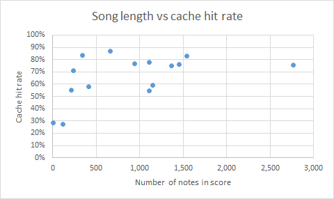

# MIDI File Synthesizer
The goal of this project is to synthesize a MIDI file using simple additive
synthesis. Various effects can also be applied to modify the sound produced.

### How it works
The program begins by parsing a MIDI file using the [mido](https://mido.readthedocs.io/en/latest/)
package. The program coverts the MIDI file into an internal score format
in order to simplify later processing. This conversion involves combining notes
from all tracks into a single score, converting  MIDI `note_on` and `note_off` into simple internal
Note structures, and handling tempo changes. At this point the transpose effect is applied,
shifting every note up or down a given number of half steps. Then, each note in the score
is synthesized. 

The sine synthesizer generates a sine wave at the base frequency of the note
being synthesized. If the number of harmonics is greater than 0, it also synthesizes that 
number of odd harmonic frequencies at reduced volume. For example, if the note is an A4 (440 Hz)
and two harmonics were specified, then the synthesizer would produce a 440 Hz sine wave Hz at 
full volume, an 1320 Hz sine wave at half volume, and a 2200 Hz sine wave at quarter volume.
The amplitude of the base frequency is 1, the first harmonic is .5, nd each successive harmonic
is half the previous. Since the series of amplitudes converges, the maximum amplitude this
generator produces is 2.

The fm synthesizer generates a frequency modulated sine wave. The carrier frequency is the frequency
of the note, and the modulation is defined by the parameters. They can be changed by passing 
the appropriate command line arguments to the program, or setting the `opts` dictionary settings.
The maximum amplitude this generator produces is 1.

With either generator, an envelope is applied to each note after it is generated.
This program uses the standard ADSR envelope. The parameters can be adjusted on the
command line or by setting the opts dictionary values. Finally, if a tremolo effect is selected,
it is applied by generating a sine wave and multiplying it with the samples of the note.
The parameters of the tremolo (amplitude and period) can be customized on the command line 
or by setting the opts dictionary.

This program uses memoization to speed up the synthesis process. When a note is first synthesized,
the resulting samples are cached. Then when a note with the same frequency, duration, and effects
is synthesized again, the samples are pulled from the cache. Depending on the song, the cache hit
is usually between 25% and 50%, but has been observed to be higher and lower. The below table lists
some of the sample MIDI files provided, and their cache hit rates. Note that longer songs tend to
have higher hit rates, since they have more notes, and can be reused more times.

 MIDI file | Number of notes | Cache hit rate
--- | --- | ---
In the hall of the Mountain King.mid | 1,455 | 76.2%
adagio.mid | 1,367 | 75.2%
amazing_grace.mid | 121 | 27.5%
britney_spears.mid | 1,111 | 77.8%
Demons.mid | 1,541 | 83.1%
Dreams and Disasters.mid | 663 | 86.7%
fur_elise.mid | 217 | 55.3%
Let_me_go.mid | 944 | 76.5%
mario.mid | 2,763 | 75.3%
moonlight_sonata.mid | 1,148 | 59%
pokemon.mid | 1,107 | 54.5%
Remember_Me_(Lullaby).mid | 413 | 58.2%
Test.mid | 8 | 28.6%
Untitled.mid | 345 | 83.7%
Yankee Doodle.mid | 234 | 70.8%

This scatter graph shows the relationship between the cache hit rate and the number of notes
in a score.


After all the notes in the score are synthesized, song-level effects are applied. At this time,
this only includes the delay effect. The delay effect adds a portion of each sample to a sample
farther along in the song. This makes an infinite delay effect that is customizable by the 
command line parameters or opts dictionary.

Because of the nature of additive synthesis, when multiple notes are played together, a sample
may have a very high amplitude. To prevent clipping when the wave file is produced, all samples
are scaled to be within the range -1 to 1. The samples are scaled such that the DC value remains
at 0. Otherwise, a popping sound can be heard at the beginning and end of the track.

The next steps converts the samples from floats in the [-1, 1] range to discrete integers in the
[-32767, 32767] range. This prepares the samples for the final step, which is converting the
samples from floats to 2-byte integers and stored as an array. The array can then be used to 
play the synthesized audio as a raw PCM stream, or save it using the built-in Python wav package.


## Dependencies
This project requires Python 3.7 to run.

This project depends on the [mido](https://mido.readthedocs.io/en/latest/)
Python package for reading and parsing MIDI files.
Additionally, if the [simpleaudio](https://pypi.org/project/simpleaudio/)
Python package is installed, it is used to play the synthesized audio to the
speakers. Otherwise, the program will still run, but the `--play` option is
disabled.

## Running
To run this project, use the following syntax:
```
python3 midi_player.py [-h] [-p] [-o filename] [--tremolo frequency amplitude]
                       [--envelope attack decay sustain release]
                       [--delay delay level] [-s {sine,fm}]
                       [--fmod frequency] [--amod amplitude]
                       [--harmonics harmonics]
                       <midi_file>
```

### Required arguments:
`<midi_file>`
Filename of the midi file to synthesize.

### Optional arguments:
`-h`, `--help`
Show a help message and exit.

`-p`, `--play`
Play the audio to the speakers after synthesizing it.
Requires the `simpleaudio` package.

`-o <filename>.wav`, `--output <filename>.wav`
Save the synthesized audio to a wav file with the given filename.

`--tremolo frequency amplitude`
Apply a tremolo effect with the given frequency and amplitude to the track.
Frequency is in hertz, and amplitude is percentage volume [0, 1]. 

`--delay delay level`
Add a delay effect.
Delay is in seconds, and level is percentage volume [0, 1). 

`--envelope attack decay sustain release`
Apply a standard ADSR envelope to each note
Attack, decay, and release are in seconds. Sustain is a percentage volume [0, 1].
Default is .02 attack, .02 decay, .7 sustain, and .2 release.

`--transpose steps`
Transpose all notes in the score up or down a given number of steps.
Steps is an integer. Positive numbers transpose up half-steps, and 
negative numbers transpose down half-steps.

`-s {sine,fm}, --synthesizer {sine,fm}`
What method to use when synthesizing a note. Possible options are `sine` to
which uses pure sine waves, and `fm` which uses frequency modulation.
Default is `sine`.

#### For fm method:
`--fmod frequency`
Frequency of modulating signal fm synthesizer.
Frequency is in hertz.

`--amod amplitude`
Amplitude of modulation of fm synthesizer.
Amplitude is in hertz. 

#### For sine method:
`--harmonics harmonics`
Number of odd harmonics to generate and add to the signal.
Harmonics is an integer. The more harmonics, the longer it takes to synthesize.

## Acknowledgements 
The fm synthesizer was adapted from code provided by Bart Massey.
https://github.com/pdx-cs-sound/fm/blob/master/fm.py
